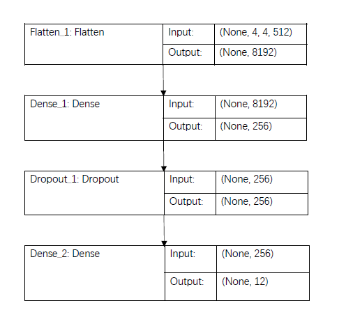

<h2># Pokemon Classification</h2>
This is a group project for ECE-GY 6143 Introduction to Machine Learning at NYU Tandon. 
 
Pokemon, a popular TV show, video game, and trading card series, originated from Japan
and has been spread all over the world since 1996. A Pokedex, a device that exists in the
world of Pokemon, is used to recognize Pokemon by scanning or learning from Pokemon
images. The current model we found on Pyimagesearch trains the CNN using Keras and
deep learning to build the underneath model of Pokedex. Because of the limited size of its
dataset and the single approach it applies, the model accuracy is not ideal. We would like to
build a better-performed model on top of the existing one by increasing the size of the
dataset and introducing different approaches: pre-trained VGG16 and PCA. 

<h3>Group 77 members are as below:  </h3>
<ul>
<li>Qin Hu (N17006855)  </li>
<li>Bohan Zhang (N13992422)  </li>
<li>Yichi Zhang (N19888469)  </li>
<li>Xintong Song (N13489466)  </li>
</ul>
 
This problem is actually a multi-classification problem. One of the primary limitations of the original project is the small amount of training data. I tested on various images and at times the classifications were incorrect. When this happened, the input image + network more closely and found that the color(s) most dominant in the image influence the classification dramatically.  

Firstly, we decided to build a new and bigger dataset. 
Because there are only limited number of pokemon pictures on flicker, we use  [Google Image](https://www.pyimagesearch.com/2017/12/04/how-to-create-a-deep-learning-dataset-using-google-images/) to build our dataset.  
>Search for a certain pokemon. 
  
>Download urls of all images on the current webpage through javascript console. 
   
>Run dataset_factory/dataset_factory.py to download all images by urls. 

Our [new dataset](https://www.dropbox.com/s/fvmfh7mq96o6aq0/new_dataset.zip?dl=0) contains 6000+ images of 12 pokemons. 
Because there are big amounts of pictures, we used 4 Tesla P100 16GB GPUs to train our networks in this project. 
Then, we tested it on original CNN network with train : test = 75% : 25%.  

  
 
After 600 epochs, the train_acc reached 0.96 but the val_acc (test accuracy) still below 0.8 and it is really bad for image classification. 
Then, we tried several different model to deal with this multi-classification. 
<h2>Method 1 Description:  </h2>
VGG16 is a convolutional neural network model proposed by K. Simonyan and A. Zisserman from the University of Oxford in the paper “Very Deep Convolutional Networks for Large-Scale Image Recognition”. The model achieves 0.92 top-5 test accuracy in ImageNet, which is a dataset of over 14 million images belonging to 1000 classes. Thus it is appropriate to deal with our problem.  
  
 

We loaded the pre-trained parameters from VGG16 and applied its layers with 4 extra layers includes 1 flatten layer, 2 fully connected layers and 1 dropout layer to our dataset. 
  
 
Method 1 Results:  
  
VGG16 significantly improve the test accuracy to 0.96. 
 

<h2>Method 2 Description:  </h2>
Using PCA to reduce the dimensionality (each image is a 67500-dimension vector) of the dataset and achieve high accuracy at the mean time.  
 
<h3>1st Approach: Using GridCV to do the optimum parameter search. </h3>

Due to low efficiency of GridSearch, even the Nvidia Tesla P100 GPU can run hours for a full size dataset (6000,150,150,3) opreation. Therefore, we load only 4 of 12 classes,200 pictures per class as dataset for this particular method. Each picture is shrinked to 50x50 by pixel and transferred to grayscale. However, these data are carefully picked so that there are less irrelevant pictures in these dataset.  There are 2500 features in tatol (800,50,50)->(800,2500).

Parameters are choosed by observation. At first, guess the range of parameters (npc, c, gamma). Fit data using GridSearchCV, then we can find the converge trendency by observing the color map. It allows us to make a more "educated" guess. Fit data using the new range of parameters. Repeat this process until global maximum are showing in the map.

Results:  
 
<ul>Limitation: <li>Need to sacrifice the quality of the picture to make the compensation for the low performance of the algorithm.</li><li>Less data to train could lead to overfitting.</li><li>Using PCA can lose some spatial information which is important for classification, so the classification accuracy decreases.</li><li>Not as good as CNN for this multiclass classfication problem.</ul>
 
<h3>2nd Approach:  </h3>
- Create two folders (train and test) and store all the pokemon images of the selected nine kinds (Arcanine, Bulbasaur, Charizard, Eevee, Lucario, Mew, Pikachu, Squirtle, and Umbereon) into separated folders 
- Use ImageDataGenerator to transform image data into data point matrices and combine train and test for scaling. At this point, the entire mini batch has 1000 images, each of which has a dimension of 67,500 (150 * 150 * 3) 
- Use StandardScaler() to rescale the data X and fit PCA to find the minimum number of PCs that make PoV greater or equal to 90% 
- Create an array of number of PCs for test (2 to the minimum number we just found) and an array of Gamma. 
- In the for loops of PC for test and Gamma for test, fit PCA on training data and SVD on transformed training data in each iteration and find the parameters which make the best accuracy  

Limitation: large dimension of almost 70,000 features but only 1,000 data points. PCA works as “feature selection” that gets rid of noises or correlations inside an image before applying any classifier. It does not work well in this case because some weird images (i.e.: pokemon on a T-shirt) are hard to detect.  

Results:  
  
